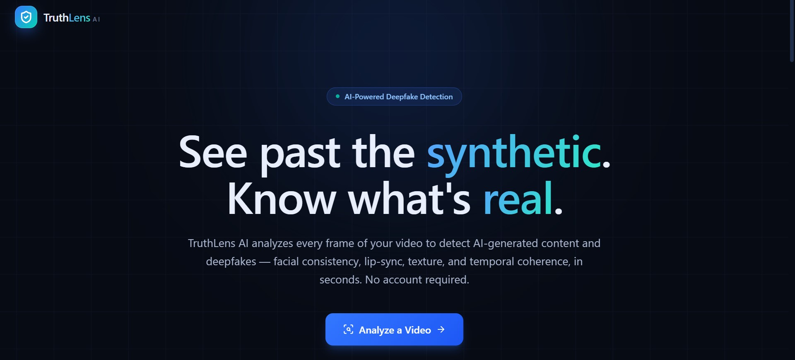
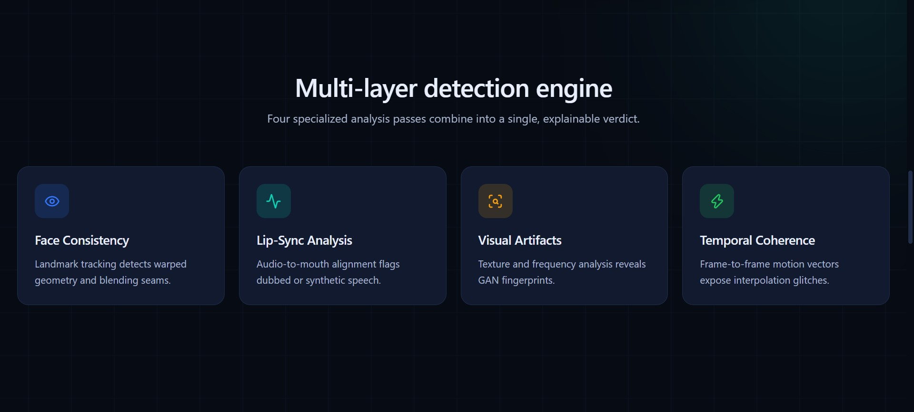
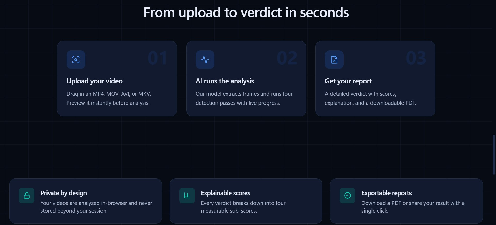
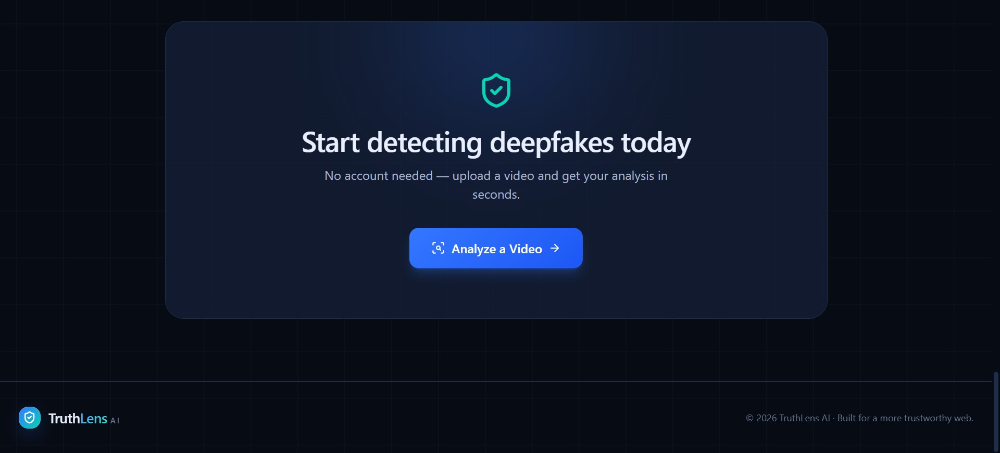
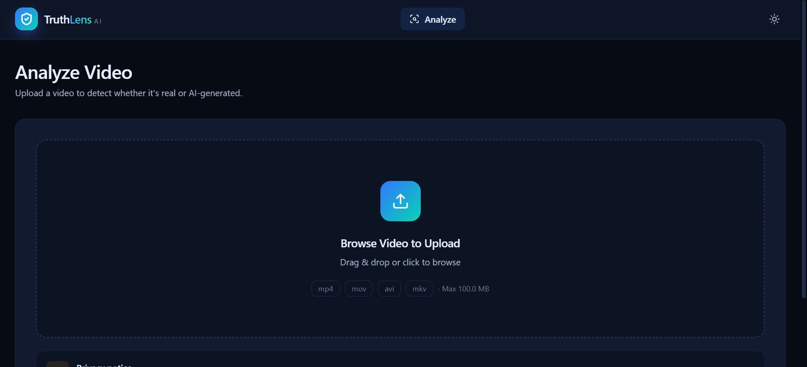
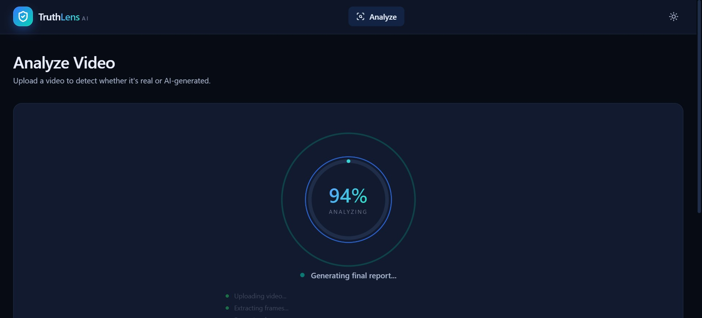
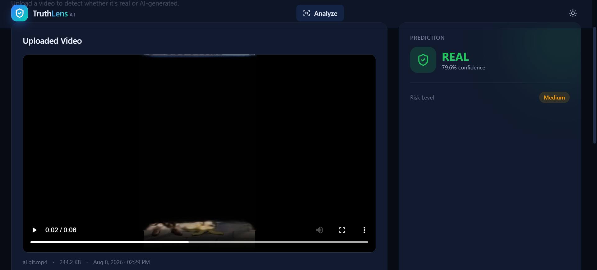
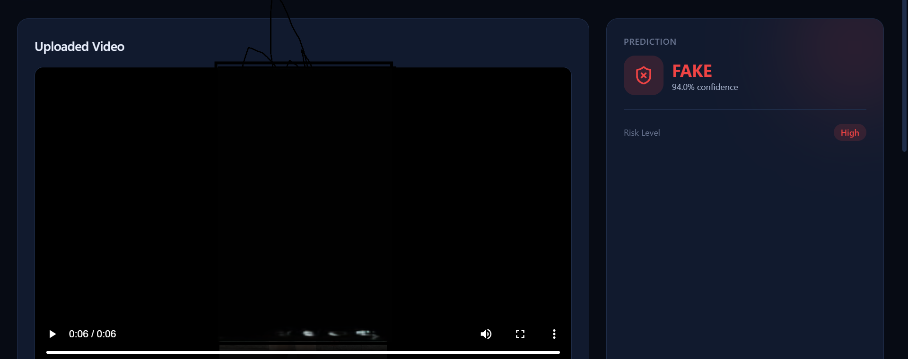
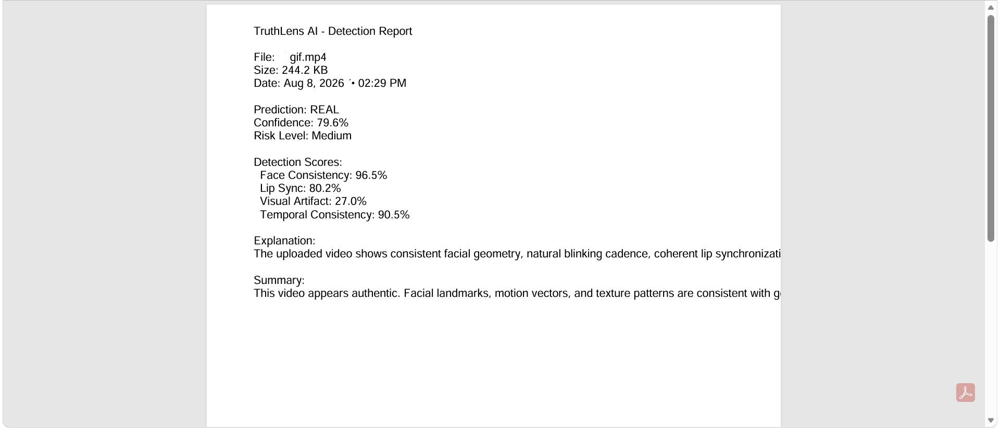
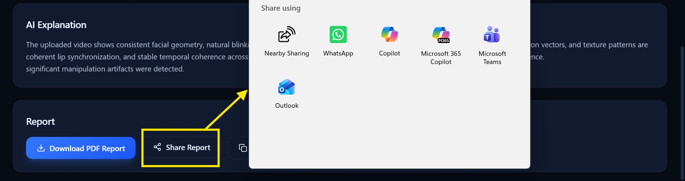

# 🔍 TruthLens.Ai

### See past the synthetic. Know what's real.

TruthLens.Ai is an AI-powered video analysis platform designed to help users assess whether a video appears authentic or potentially manipulated.

From uploading a video to receiving an explainable analysis report, TruthLens.Ai evaluates multiple visual and temporal signals to generate an overall confidence and risk assessment.

---

## 🚀 What is TruthLens.Ai?

With the rapid growth of AI-generated and manipulated media, it is becoming increasingly difficult to distinguish authentic videos from synthetic content.

**TruthLens.Ai** analyzes uploaded videos across multiple dimensions and presents the results through an easy-to-understand report.

It provides:

- 🎯 Authenticity / confidence assessment
- ⚠️ Risk level analysis
- 👤 Face consistency analysis
- 👄 Lip-sync analysis
- 🎨 Visual artifact detection
- ⏱️ Temporal coherence analysis
- 📊 Explainable analysis scores
- 📄 Exportable reports
- ✅ Download the Reports in PDF format

> **Note:** TruthLens.Ai is an analysis and decision-support tool. Its results should be treated as an assessment rather than absolute proof of authenticity.

---

## ✨ Key Features

### 💎 Modern & Responsive UI

Clean, modern design with a smooth and user-friendly experience.

### 🎯 Confidence & Risk Assessment

Get an overall assessment of the analyzed video with clear confidence and risk indicators.

### 👤 Face Consistency Analysis

Examines facial consistency across video frames to identify unusual changes or inconsistencies.

### 👄 Lip-Sync Analysis

Analyzes the relationship between facial/lip movements and the video's audio to identify potential synchronization anomalies.

### 🎨 Visual Artifacts

Looks for visual inconsistencies and artifacts that may indicate manipulation or synthetic generation.

### ⏱️ Temporal Coherence

Analyzes how visual information changes across consecutive frames to identify unusual temporal patterns.

### 📊 Explainable Scores

Instead of showing only a final verdict, TruthLens.Ai breaks the analysis into understandable signals so users can better understand how the assessment was formed.

### 📄 Exportable Reports

Generate an analysis report that can be saved and shared for further review.

### ✅ Download Reports

Download detailed reports in PDF format.

### 🔒 Private by Design

The platform is designed with privacy in mind, keeping the video-analysis experience focused on the user's uploaded content and results.

---

## ⚡ From Upload to Verdict in Seconds

TruthLens.Ai keeps the workflow simple:

```text
📤 Upload Your Video
        ↓
🤖 AI Runs the Analysis
        ↓
🔍 Multiple Signals Are Evaluated
        ↓
📊 Confidence & Risk Are Calculated
        ↓
📄 Get Your Analysis Report


🧠 Analysis Pipeline
TruthLens.Ai evaluates multiple signals rather than relying on a single indicator.
                 ┌─────────────────────┐
                 │     Video Upload    │
                 └──────────┬──────────┘
                            ↓
                 ┌─────────────────────┐
                 │   Video Processing  │
                 └──────────┬──────────┘
                            ↓
        ┌───────────────────┼───────────────────┐
        ↓                   ↓                   ↓
 Face Consistency     Lip-Sync Analysis   Visual Artifacts
        │                   │                   │
        └───────────────────┼───────────────────┘
                            ↓
                  Temporal Coherence
                            ↓
                 ┌─────────────────────┐
                 │ Explainable Scoring │
                 └──────────┬──────────┘
                            ↓
                 ┌─────────────────────┐
                 │ Confidence / Risk   │
                 │      Assessment     │
                 └──────────┬──────────┘
                            ↓
                 📄 Analysis Report


🖥️ Screenshots

🏠 Home / Landing Page







📤 Video Upload




📊 Analysis Dashboard

Analysis



“Upload a real video to analyze and verify whether it is authentic.”
REAL VIDEO :
   

“Upload an AI-generated video, and it will detect whether the video is AI-generated and provide an analysis.”
AI VIDEO :
   


🔍 Detailed Analysis
REAL VIDEO DETAILED ANALYSIS :
      

FAKE VIDEO DETAILED ANALYSIS :
      


📄 Download Report in PDF format




🔄️ Share your Reports




🌐 Live Demo
🚀 Try TruthLens.Ai:
              [LiveDemo](https://truthlensai-com.netlify.app/#/)


🛠️ Tech Stack
HTML5
CSS3
TypeScript
AI-powered video analysis
Responsive Web Design
Netlify
Git & GitHub

🎯 Project Goals

TruthLens.Ai was created with a simple goal:
Make AI-generated and manipulated media analysis easier to understand and more accessible.
The project focuses on combining:
AI-assisted analysis
Explainable results
Simple user experience
Privacy-conscious design
Fast video processing
Clear visual reporting

🔐 Privacy & Responsible Use
TruthLens.Ai is designed with privacy and responsible media analysis in mind.
Users should avoid uploading sensitive, private, or confidential videos unless they have the appropriate permission to analyze them.
AI-based detection can have limitations and may produce false positives or false negatives. Results should therefore be considered alongside other evidence and human judgment.

📈 Future Improvements
Planned improvements may include:

🎥 Advanced deepfake detection models
🧠 Improved multimodal analysis
🔊 Advanced audio analysis
📱 Mobile application
🌍 Multi-language support
📊 Historical analysis dashboard
🔗 Shareable verification reports
⚡ Faster processing for longer videos
👨‍💻 Project

TruthLens.Ai
An AI-powered approach to understanding the authenticity of digital video.
Tagline
See past the synthetic. Know what's real.

⭐ Support
If you find this project interesting, consider giving the repository a ⭐ on GitHub.

⚠️ Disclaimer
TruthLens.Ai provides an AI-assisted assessment of video authenticity.
It does not guarantee that a video is definitively real or fake. Detection results may vary depending on video quality, compression, manipulation techniques, and available analysis signals.
